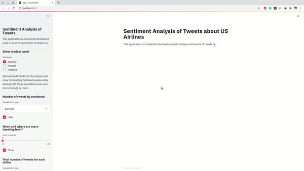

## Interactive Dashboard with Streamlit and Python
This is an interactive dashboard built with a few lines of python code for the sentiment analysis of tweets about US Airlines.

### How to Run?

Create a virualenv:  
`conda create -n myenv python=3.6`

Activate:  
`conda activate myenv`

Install Requirements:  
`pip install -r requirements.txt`

Run:  
`streamlit run app.py`
